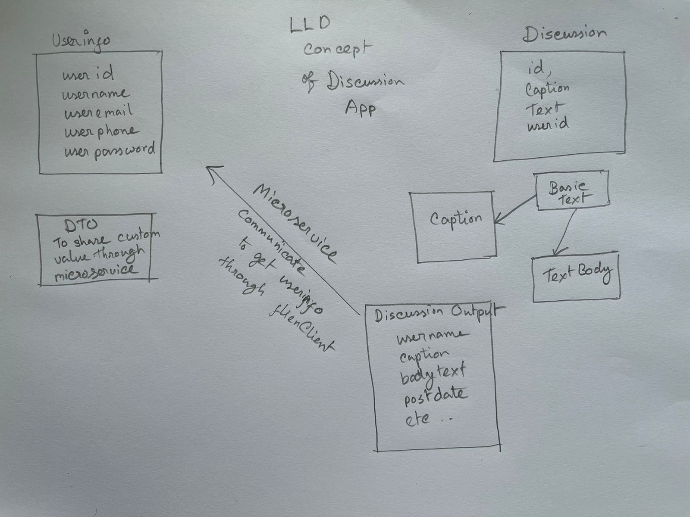

# Discussion-App

#### Er Diagram



#### This is a springboot project which provide Web Service (REST API). 

#
#### User can,
1. Create a User account.
2. Update your account details.
3. Login to your account.
4. Delete account
5. Search accounts by name
6. get all acounts


#### Discussion can,
1. Create a discussion.
2. Update a discussion
3. Search a discussion by hashtag
4. Delete a discussion


#### How to use?

As this is a rest API project, client part hasn't added to it. But you can use Swagger or Postman to play with the API. And also you can use this API with your frontend project. As it will be on localServer on your PC you need to keep the server on while playing with it. Steps given below for additional info,
#
```
1. CREATE database newTestDatabase;
```
#
Create a database on your local system. If you don't have MySQL installed, kindly install it first. 
- [Install](https://dev.mysql.com/doc/refman/8.0/en/macos-installation.html) - On Mac
- [Install](https://dev.mysql.com/doc/refman/8.0/en/windows-installation.html) - On Windows
- [Install](https://dev.mysql.com/doc/mysql-shell/8.0/en/mysql-shell-install-linux-quick.html) - On Linux
#
Once Installed please set/keep your mysql credentials as below 
#

```
username: root
password: root
```


```
2. git clone https://github.com/starving-array/Discussion-Portal.git;
```
#
Clone this repo to your local system and open STS to import and run the project. 
If you don,t have STS IDE on your system, kindly download [STS](https://spring.io/tools).
Or You can go with any other IDE of your choice
#

```
3. Open STS and Import the Project;
```
#
File -> Open Projects from File Systems -> Directory
- Browse to the location where you have cloned this project. And select DiscussionApp and UserInfoApp in separate windown as you have to run both to work in different server (Microservice)
#
Next-> Finish. _It might take a few minutes to download all the dependencies on your local system. You can check the progress bar at righ-down corner._  
#
Once finished update the Maven project to make sure all the dependencies have downloaded.
#
Maven -> Update Project -> check Force Update on SnapShots/releases -> Ok
#

 _Congratulation, you've successfully imported the project on your system_

#

```
4. Start the Spring Boot App Server;
``` 

#
Right Click on mainApp at package exporer on leftside window, 
Run as -> Spring Boot App
#

_You can see the process as a console window will be opening below._

#


#### Important Facts,
1. _The port for this application has set 8010 and 8011. You can change it from Application Properties in resource folder, or stop any other running app before starting this as it can create conflict for same port that you might be using coincedently._

#
```
#changing the server port
server.port=8088
```
#

2. _Incase if have different root name and password for mysql in your system, you change this application username and password from Application Properties.

#
```
# MySql username and Password
spring.datasource.username=root
spring.datasource.password=root
```

There are still scope of so many more API based on business logic and demand. Hope you have fun playing and liked it. 
```
#### Thank you...  
